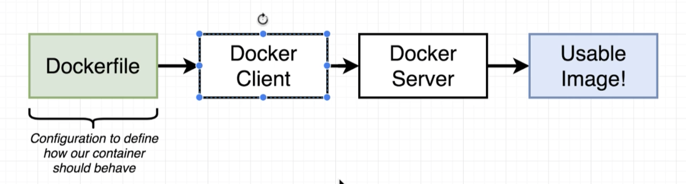
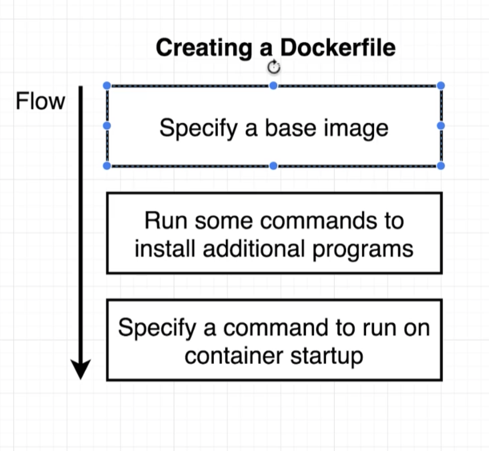

## Dockerfile
- We can create own images using dockerfile

---
- tag an image: `docker build -t <container_id/repo_name:version>`

- run command in a container: `docker commit -c 'CMD ["command"] <container_id>` (manual generate docker image)
