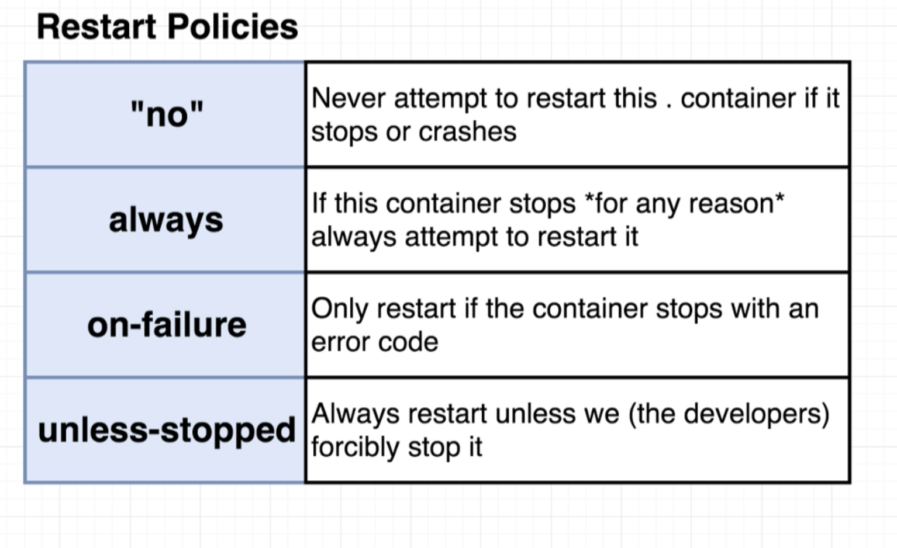

## Connect multiple containers
- Use Docker CLI's Networking Features
- Use Docker Compose

## Docker Compose
- `docker run <image>` = `docker-compose up`
- `docker build . && docker run <image>` = `docker-compose up --build` 
- run in background: `docker-compose up -d`
- terminate: `docker-compose down`
- container status: `docker-compose ps` (run in directory has docker-compose file)
- Restart policies:
