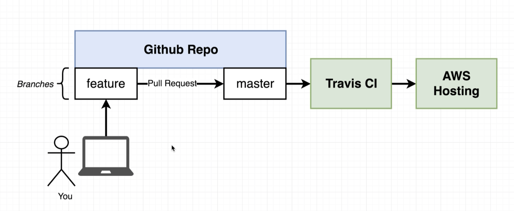

## Docker Volumes
- Problem: when updating files in local machine, files in docker are not updated automatically
- The idea of volumes is about set the reference of application folder in docker to local machine

